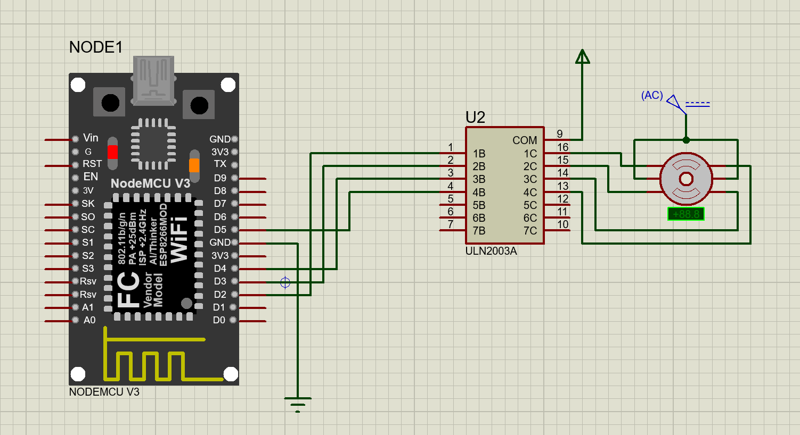

# ⚙️ Stepper Motor Control Using NodeMCU (ESP8266) and ULN2003A Driver

This project demonstrates how to control a **unipolar stepper motor (28BYJ-48)** using a **NodeMCU V3 (ESP8266)** and a **ULN2003A driver**.  
The simulation is built and tested in **Proteus 8 Professional**.

---

## 🛠️ Components Used
- 🖥️ NodeMCU V3 (ESP8266)  
- 🔌 ULN2003A Motor Driver  
- 🌀 Unipolar Stepper Motor (28BYJ-48)  
- ⚡ External Power Supply (for motor)  
- 📐 Proteus 8 Professional (for simulation)  

---

## 📊 Circuit Overview
- NodeMCU sends control signals to the ULN2003A driver.  
- ULN2003A amplifies the current required by the motor.  
- An external power supply prevents overloading the NodeMCU.  

---

## 🔗 Connections

| NodeMCU Pin | ULN2003A Pin | Function        |
|-------------|--------------|----------------|
| D2          | IN1 (1B)     | Stepper coil A |
| D3          | IN2 (2B)     | Stepper coil B |
| D4          | IN3 (3B)     | Stepper coil C |
| D5          | IN4 (4B)     | Stepper coil D |
| GND         | GND          | Common ground  |

The motor coils connect to ULN2003A outputs **16, 15, 14, and 13**.

---

## 💻 Code
The Arduino sketch (`StepperMotorController.ino`) provides the step sequence to rotate the motor.  
You can adjust `PATTERN_DELAY` in the code to control the speed.

---

## 🖼️ Circuit Diagram
  

---

## 🧪 Simulation
This project was designed and tested in **Proteus 8 Professional** for validation before real hardware implementation.

